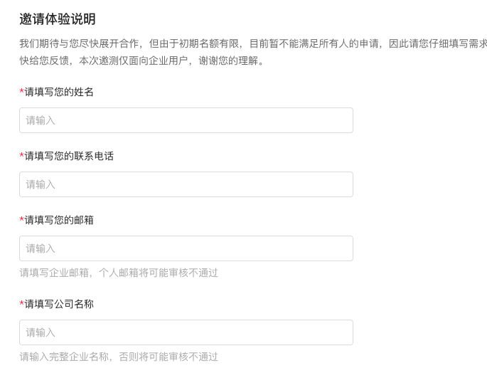

# 文心一言注册指南

## 网站使用申请

文心一言官网地址：https://yiyan.baidu.com/welcome

去官网直接申请即可，目前需要排队等待。

 

申请成功后，会得到一个邀请码，登录官网，输入邀请码即可进入到和文心一言的对话界面。

申请成功的通知短信如下所示：

> 【百度】文心一言：您现在可以体验了，快来向我提问吧。请访问地址链接 https://yiyan.baidu.com/invitationCode，使用百度账号登录，正确输入以下邀请码 xxx，开通账号访问权后，即可进入内测。

## API使用申请

需要去百度智能云官网申请。

申请地址：https://cloud.baidu.com/survey_summit/wenxin.html?track=C816552

 

updated 2023.04.16: 目前百度文心一言由于算力资源紧缺，API权限申请需要排队，暂时优先考虑签约了合作协议的企业客户。