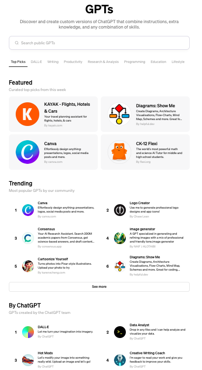

# 一文读懂GPT Store

## 背景

2023年11月6日举行的OpenAI第一届开发者大会上，OpenAI官宣了GPTs，大家无需写代码就可以实现满足特定需求场景的自定义ChatGPT。

截止到2024年1月，已经有超过300万个性化ChatGPT诞生。

OpenAI原本计划在2023年11月发布GPT Store，但是由于11月OpenAI董事会的权力斗争，GPT Store上线被搁置。

>  The GPT Store is rolling out later this month

>  Starting today, you can create GPTs and share them publicly. Later this month, we’re launching the GPT Store, featuring creations by verified builders. Once in the store, GPTs become searchable and may climb the leaderboards. We will also spotlight the most useful and delightful GPTs we come across in categories like productivity, education, and “just for fun”. In the coming months, you’ll also be able to earn money based on how many people are using your GPT.

终于，在2024年1月10号，OpenAI正式上线GPT Store，开放给ChatGPT Plus会员、团队(Team)和企业用户(Enterprise)。

## GPT Store官网

GPT Store访问地址：https://chat.openai.com/gpts

 

在GPT Store官网可以看到各种不同类型的GPTs。

## 每周优秀GPTs推荐

GPT Store会对有影响力的GPTs做重点推荐，列在Featured板块。

第一批被列入Featured推荐的是：

- 个性化的远足、骑行和跑步路线规划：[AllTrails](https://chat.openai.com/g/g-KpF6lTka3-alltrails)
- 学术论文搜索： [Consensus](https://chat.openai.com/g/g-bo0FiWLY7-researchgpt)
- Khan Academy的代码编写工具： [Code Tutor](https://chat.openai.com/g/g-HxPrv1p8v-code-tutor-khanmigo-lite)
- 设计工具： [Canva](https://chat.openai.com/g/g-alKfVrz9K-canva)
- 读书推荐： [Books](https://chat.openai.com/g/g-z77yDe7Vu)
- 数学和科学助教： [CK-12 Flexi](https://chat.openai.com/g/g-cEEXd8Dpb-ck-12-flexi) 

## 如何在GPT Store引入你的GPTs

打造自己的GPTs非常简单，无需任何代码编写技能，只需要按照如下2步操作即可：

1. 在GPT Store创建自己的GPTs，保存自己的GPT权限为Save your GPT for **Everyone**
2. 验证你的开发者(Builder)信息 (**Settings** → **Builder profile** → **Enable your name or a verified website**)

需要确认确保你的GPTs是合规的，满足OpenAI的要求： [usage policies](https://openai.com/policies/usage-policies) 和 [GPT brand guidelines](https://openai.com/brand#gpts-in-chatgpt) 。

OpenAI搭建了一套审核系统来对上架的GPTs做审核，包含人工审核和自动化审核。

此外，用户也可以对上架的GPTs进行举报。

## 开发者GPT Store收入

在2024年第一季度，OpenAI会启动GPTs 开发者收入分成项目。

第一个动作是美国开发者可以根据他们发布的GPTs的使用情况来进行收入分成。

后续上线的时候，OpenAI会公布更多收入分成细节。

## 团队和企业客户可以管理自己的GPTs

OpenAI在上线GPT Store的同时，发布了[ChatGPT Team](http://openai.com/chatgpt/team) 计划。

购买了ChatGPT Team计划的客户在GPT Store里有一个仅属于自己Team的私密GPT Store。

GPT Store很快会发布ChatGPT Enterprise版本，会在更加更丰富的管理控制功能，方便企业客户控制内部的GPTs如何分享，以及控制外部的GPTs是否可以在企业内部使用。

OpenAI承诺不会使用ChatGPT Team和ChatGPT Enterprise的对话记录用于模型训练和优化。

## 总结

文章和示例代码开源在GitHub: [GPT实战教程](https://github.com/jincheng9/gpt-tutorial)，可以看到所有主流的开源LLM。

公众号：coding进阶。关注公众号可以获取最新GPT实战内容。

个人网站：[Jincheng's Blog](https://jincheng9.github.io/)。

知乎：[无忌](https://www.zhihu.com/people/thucuhkwuji)。

## References

* https://openai.com/blog/introducing-the-gpt-store