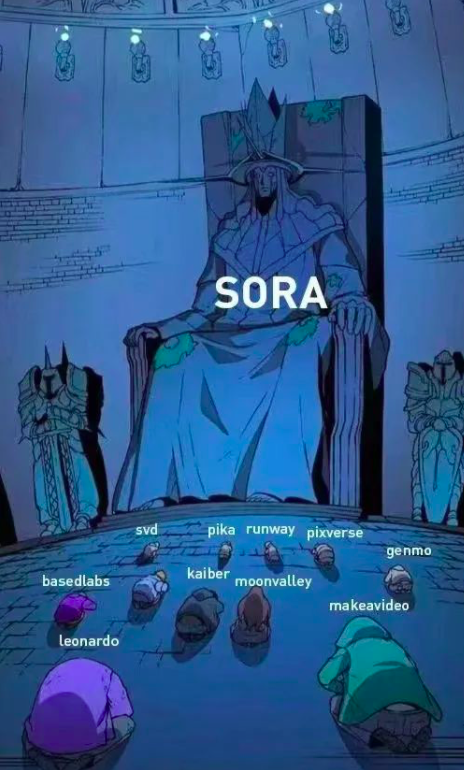

# OpenAI发布重磅新模型再次遥遥领先

## 背景

OpenAI在2024年2月16日发布了史上最强大的文生视频模型Sora。

这是继文生文模型(ChatGPT)、文生图模型(DALL·E 3)后，OpenAI在一个更有挑战性的文生视频(text-to-video)领域再次遥遥领先。

 

诸如Pika、Runway等文生视频领域的创业公司很可能要面临生存危机了。

## Sora强大之处

Sora的强大之处可以用

## 局限性

## 技术细节

https://openai.com/research/video-generation-models-as-world-simulators

## 总结

文章和示例代码开源在GitHub: [GPT实战教程](https://github.com/jincheng9/gpt-tutorial)，可以看到所有主流的开源LLM。

公众号：coding进阶。关注公众号可以获取最新GPT实战内容。

个人网站：[Jincheng's Blog](https://jincheng9.github.io/)。

知乎：[无忌](https://www.zhihu.com/people/thucuhkwuji)。

## References

* https://openai.com/sora

* https://openai.com/research/video-generation-models-as-world-simulators
