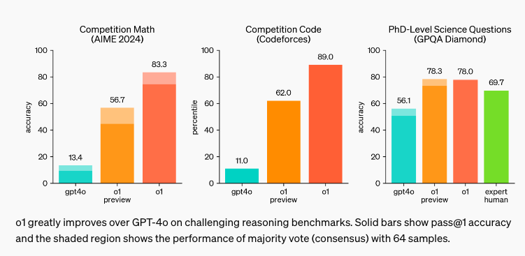
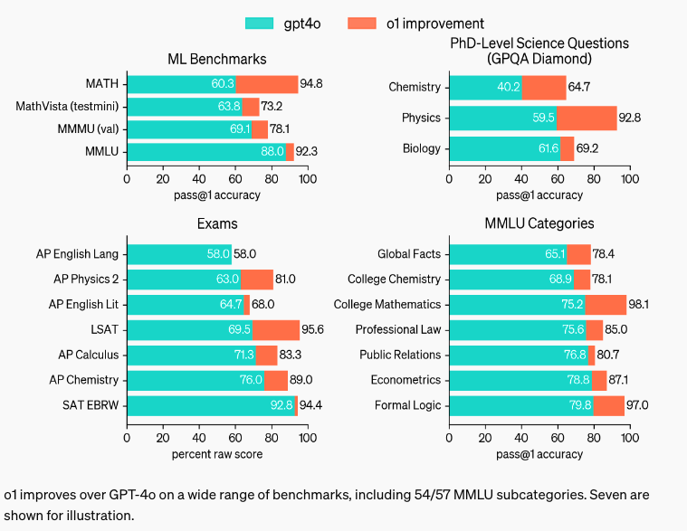

# OpenAI发布重磅新模型o1

## 背景

OpenAI在2024.09.12发布了全新系列的大模型o1。

o1通过强化学习来进行训练，最大亮点是可以处理复杂的逻辑推理任务，在科学、代码和数学相关回答上表现更好。

o1给出回答前会耗费更多的时间做思考，因此响应时间比GPT-4系列要长一些。

## 模型表现

我们来看看o1模型对比gpt4o的表现：

可以明显看到，在数学、代码生成、科学和逻辑推理等方面，o1要明显强于gpt4o。

## o1模型揭秘

OpenAI训练这些模型在回答问题之前花更多时间进行思考，就像人类会做的那样。

通过训练，他们学会了优化他们的思考过程、尝试不同策略，并且认识到他们的错误。

在测试中，o1的下一个模型更新在物理、化学和生物学中的挑战性基准任务上的表现与博士生相似。

o1在数学和编程上表现出色。在国际数学奥林匹克竞赛（IMO）的资格考试中，GPT-4o只正确解决了13%的问题，而推理模型的得分为83%。它们的编码能力在竞赛中被评估，在Codeforces比赛中达到了第89百分位。

作为一个早期模型，它还没有很多使ChatGPT实用的功能，如浏览网页获取信息以及上传文件和图片。对于许多常见情况，GPT-4o在近期内将更加有能力。

但是对于复杂的推理任务，这是一个重大进步，代表了AI能力的新水平。

鉴于此，OpenAI决定将大模型命名的计数器重置为1，并将这个系列命名为OpenAI o1。

## 模型安全

在开发这些新模型的过程中，OpenAI提出了一种新的安全训练方法，该方法利用模型的推理能力使它们遵守安全和一致性指南。

通过在上下文中对安全规则进行推理，o1模型可以更有效地应用这些安全规则。

衡量模型是否安全的一种方式是测试如果用户试图绕过模型（被称为“越狱”），那模型在多大程度上继续遵循其安全规则。

在最困难的越狱测试之一中，GPT-4o得分为22（在0-100的范围内），而o1模型得分为84，遥遥领先。

为了推进对AI安全的承诺，OpenAI最近与美国和英国的AI安全研究所正式达成了协议，协议包括向这些研究所提前提供该模型研究版本的访问权限。

## o1模型的用户群体

如果你在科学、编程、数学和类似领域解决复杂问题，这些增强的推理能力可能特别有用。

例如，o1可以被医疗研究人员用来标注细胞测序数据，被物理学家用来生成量子光学所需的复杂数学公式，以及被各个领域的开发者用来构建和执行多步骤工作流程。

## OpenAI o1-mini

o1系列在准确生成和调试复杂代码方面表现出色。

为了为开发者提供一个更高效的解决方案，OpenAI还推出了[OpenAI o1-mini](https://openai.com/index/openai-o1-mini-advancing-cost-efficient-reasoning/)，这是一个更快、更便宜的推理模型，特别擅长编码。

作为一个较小的模型，o1-mini的成本比o1-preview低80%，使其成为一个强大而经济高效的模型，适用于需要推理但不需要广泛世界知识的应用。

## 如何使用OpenAI o1

**ChatGPT Plus和Team**用户已经可以在ChatGPT中直接使用o1模型。

o1-preview和o1-mini都可以在模型选择器中手动选择。

o1目前处于刚上线阶段，每周的使用限制是o1-preview 30条消息，o1-mini 50条消息。

OpenAI正在努力提高使用上限，并使ChatGPT能够自动为给定的prompt选择合适的模型。

**ChatGPT Enterprise和Edu**用户将从下周开始获得两种模型的访问权限。

[Tier 5](https://platform.openai.com/docs/guides/rate-limits/usage-tiers)条件的API**开发者**今天就可以开始使用这两种模型的API。

| TIER   | QUALIFICATION                                                | USAGE LIMITS    |
| ------ | ------------------------------------------------------------ | --------------- |
| Free   | User must be in an [allowed geography](https://platform.openai.com/docs/supported-countries) | $100 / month    |
| Tier 1 | $5 paid                                                      | $100 / month    |
| Tier 2 | $50 paid and 7+ days since first successful payment          | $500 / month    |
| Tier 3 | $100 paid and 7+ days since first successful payment         | $1,000 / month  |
| Tier 4 | $250 paid and 14+ days since first successful payment        | $5,000 / month  |
| Tier 5 | $1,000 paid and 30+ days since first successful payment      | $50,000 / month |

API调用速率限制为每分钟20次请求。OpenAI在进行额外测试后正在努力增加这些限制。

**注意：** o1-preview和o1 mini的API当前不包括函数调用、流式处理、对系统消息的支持以及其他功能。要开始，请查看[API文档](http://platform.openai.com/docs/guides/reasoning)。

后续OpenAI计划为所有**ChatGPT** **免费用户**提供o1-mini的访问权限。

## OpenAI下一步工作

OpenAI会进一步迭代o1模型，还会添加上网、文件和图像上传等功能，使o1对每个人都更加有用。

除了这个全新的o1系列模型之外，OpenAI还会继续开发和发布GPT系列模型，并不会抛弃GPT系列模型，开发者不用担心。

## 总结

文章和示例代码开源在GitHub: [GPT实战教程](https://github.com/jincheng9/gpt-tutorial)，可以看到所有主流的开源LLM。

公众号：coding进阶。关注公众号可以获取最新GPT实战内容。

个人网站：[Jincheng's Blog](https://jincheng9.github.io/)。

知乎：[无忌](https://www.zhihu.com/people/thucuhkwuji)。

## References

* https://openai.com/index/introducing-openai-o1-preview/

* https://openai.com/index/learning-to-reason-with-llms/

* https://openai.com/index/openai-o1-system-card/
