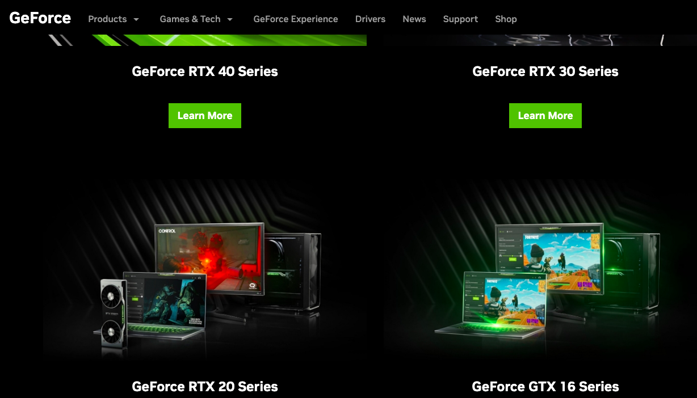
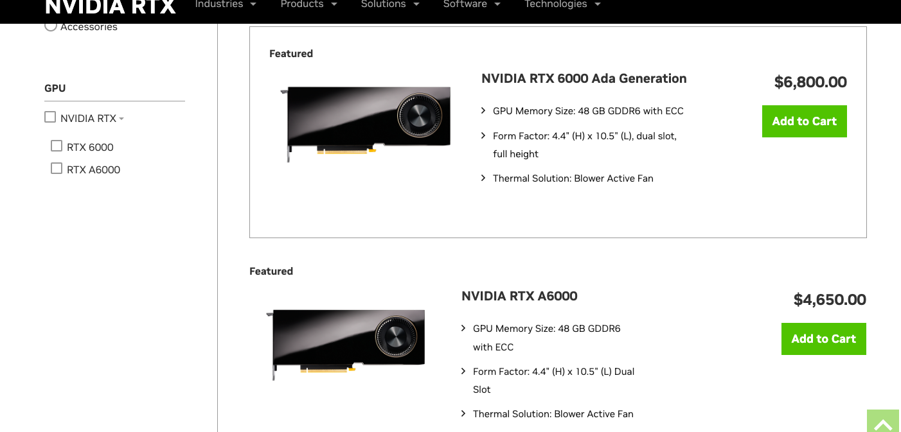
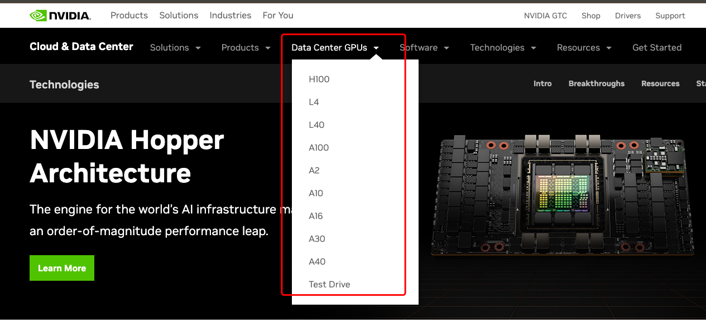
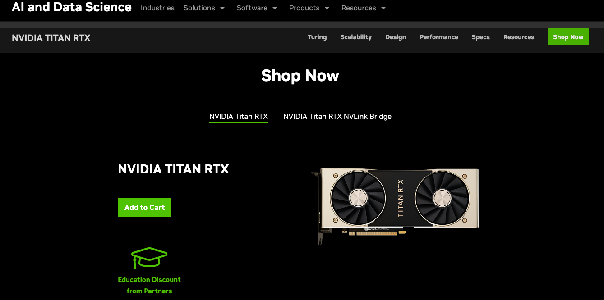

# Nvidia GPU型号

* GeForce系列
* Nvidia RTX/Quadro系列
* Data Center系列
* Titan RTX系列

## GeForce系列

官网地址：https://www.nvidia.com/en-us/geforce/graphics-cards/

有4个系列，按照发布时间排序，40系列是最新的。

* GeForce RTX 40 系列：https://www.nvidia.com/en-us/geforce/graphics-cards/40-series/
* GeForce RTX 30 系列：https://www.nvidia.com/en-us/geforce/graphics-cards/30-series/
* GeForce RTX 20 系列：https://www.nvidia.com/en-us/geforce/20-series/
* GeForce GTX 16 系列：https://www.nvidia.com/en-us/geforce/graphics-cards/16-series/

## Nvidia RTX/Quadro系列

官网地址：https://www.nvidia.com/en-us/design-visualization/rtx/

目前可以只买GPU的Nvidia RTX型号是：Nvidia RTX A6000和NVIDIA RTX 6000 Ada Generation，其它Nvidia RTX型号集成在笔记本里头，无法单独购买。

购买地址和产品信息：https://store.nvidia.com/en-us/nvidia-rtx/store/?page=1&limit=9&locale=en-us&category=GPU

## Data Center系列

官网地址：https://www.nvidia.com/en-us/data-center/technologies/hopper-architecture/

大家熟知的用于AI加速训练的显卡主要是这个系列。

比如大家熟知的A100、A10等就是这个系列，面向企业客户为主。

## Titan RTX系列

官网地址：https://www.nvidia.com/en-us/deep-learning-ai/products/titan-rtx/

这个系列的GPU目前只有Nvidia Titan RTX一款型号。

