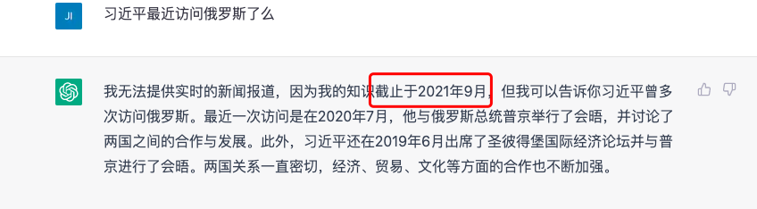
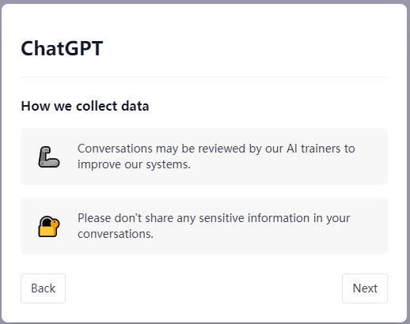

# ChatGPT常见概念

## GPT

GPT: Generative Pre-trained Transformer

生成式预训练Transfomer，是OpenAI大模型的技术核心。

## Prompt和Completion

* prompt可以理解为GPT模型的输入
* completion可以理解为GPT模型的输出结果

## Model

OpenAI支持包括GPT-4, GPT-3.5, DALL-E, Whisper等众多Model，每个Model有各自的适用场景。

比如GPT-4是基于GPT-3.5衍生出来的，比GPT-3.5更强大，有更多参数，支持多模态，可以根据图片输出文本。

DALL-E可以根据文本生成图片。

Whisper可以根据录音生成文本。

* [OpenAI的Model列表和具体说明](https://platform.openai.com/docs/models)

注意：

* 上面提到的GPT-4，GPT-3.5等，其实每一个都可以理解为一个Model Family，每个Model Family包含有更细分的版本，比如GPT-3.5这个Model Family有gpt-3.5-turbo，text-davinci-003等多个Model。

* 以上模型的Training Data数据截止到2021年9月，未来可能会引入更新的Training Data。

* ChatGPT不能联网获取最新知识，但是ChatGPT推出了[ChatGPT plugin](https://openai.com/blog/chatgpt-plugins)，可以通过插件的方式获取最新知识。

  

### ChatGPT

免费版的ChatGPT基于GPT-3.5Model实现，升级为Plus会员可以使用最新的GPT-4。

* [在线对话入口](https://chat.openai.com/chat)

### DALL-E

* [画图入口](https://labs.openai.com/)

## Token

* [token分割和个数统计可视化](https://platform.openai.com/tokenizer)
* [每个Model支持的最大token](https://platform.openai.com/docs/models/overview)
* [程序计算token数量](https://github.com/openai/openai-cookbook/blob/main/examples/How_to_count_tokens_with_tiktoken.ipynb)

## API

官方支持发送裸的http请求来获取结果，同时封装了Python和Node.js的library。

其它语言的library官方没有开发，由社区提供。

* [Python API](https://github.com/openai/openai-python)

* [NodeJS API](https://github.com/openai/openai-node)

* [其它语言的API](https://platform.openai.com/docs/libraries)

* [配置或者查看API Keys](https://platform.openai.com/account/api-keys)
* [查看Organization ID](https://platform.openai.com/account/org-settings)

## Embedding

> In machine learning, an embedding is a way of representing data as points in n-dimensional space so that similar data points cluster together.
>
> Embeddings are a way of representing data–almost any kind of data, like text, images, videos, users, music, whatever–as points in space where the locations of those points in space are semantically meaningful.

Embedding本质上就是把输入(例如文本、图片、视频等)转换为一个固定长度的向量进行表示。

参考：https://daleonai.com/embeddings-explained

##  数据隐私和安全

* 从2023年3月1日开始，OpenAI不会把用户**通过API发送的数据**放到模型的训练集里来训练和优化模型。

并且，通过API发送的数据只保留最多30天，超过30天后，通过API发送的数据会被删除。

详情参考：[API Data Usage Policies](https://openai.com/policies/api-data-usage-policies)。

> Starting on March 1, 2023, we are making two changes to our data usage and retention policies:
>
> 1. OpenAI will not use data submitted by customers via our API to train or improve our models, unless you explicitly decide to share your data with us for this purpose. You can [opt-in to share data](https://docs.google.com/forms/d/e/1FAIpQLSevgtKyiSWIOj6CV6XWBHl1daPZSOcIWzcUYUXQ1xttjBgDpA/viewform).
> 2. Any data sent through the API will be retained for abuse and misuse monitoring purposes for a maximum of 30 days, after which it will be deleted (unless otherwise required by law).
>
> Note that this data policy does not apply to OpenAI's Non-API consumer services like [ChatGPT](https://chat.openai.com/) or [DALL·E Labs](https://labs.openai.com/). You can learn more about these policies in our [data usage for consumer services FAQ](https://help.openai.com/en/articles/7039943-data-usage-for-consumer-services-faq).

* 如果是在网站上对话，没有用API，那网站上对话内容是有可能被OpenAI拿去做训练的。下图是官网的说明，不要在网站上输入敏感信息。

 

