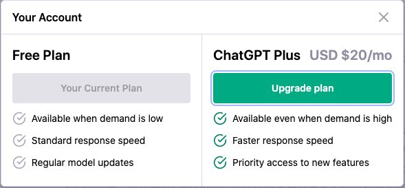

# GPT收费说明

* 网页版的ChatGPT暂时不收费，ChatGPT Plus每月20美金。这2种模式都是在网页上操作。

   

* 通过API来使用ChatGPT等不同的模型需要收费，根据token数量收费，不同的Model收费标准不一样。

>  Multiple models, each with different capabilities and price points. Prices are per 1,000 tokens. You can think of tokens as pieces of words, where 1,000 tokens is about 750 words. This paragraph is 35 tokens.

按照1000个token作为单位收费，每1000个token约等于750个单词。

##  GPT-4收费

| **Model**   | **Prompt**        | **Completion**    |
| ----------- | ----------------- | ----------------- |
| 8K context  | $0.03 / 1K tokens | $0.06 / 1K tokens |
| 32K context | $0.06 / 1K tokens | $0.12 / 1K tokens |

## GPT-3.5收费

| **Model**     | **Usage**          |
| ------------- | ------------------ |
| gpt-3.5-turbo | $0.002 / 1K tokens |

## 其它模型收费

参考 https://openai.com/pricing

## 注意事项

* ChatGPT Plus每月20美金的付费只是针对网页版本，如果要使用API的话，那API是额外单独收费的，并不是购买了ChatGPT Plus就可以免费使用API了。
* prompt的token和completion的token都收费。也就是你API发送的请求数据以及OpenAI返回的响应数据都会计算token，都会收费。

## Reference

* https://openai.com/pricing