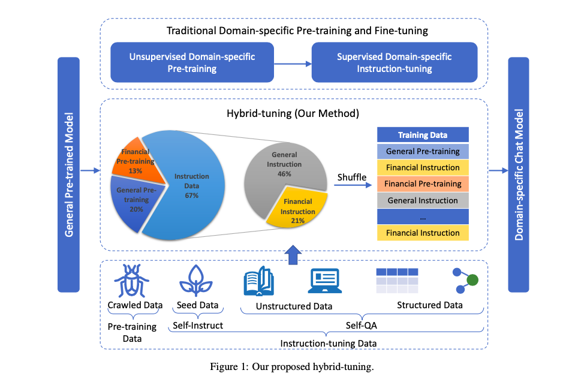

# 轩辕：首个千亿级中文金融对话模型

## 背景

目前开源的大语言模型或多或少存在以下痛点：

* 缺少专门针对中文进行优化过的的大语言模型。

* 支持中文的开源模型的参数规模偏小，没有超过千亿。比如清华和智谱AI的ChatGLM-6B目前只开源了6B参数模型，盘古alpha也只开源了13B的模型。
* 支持金融这个垂直领域的开源模型基本没有。前段时间Bloomberg发布的BloombergGPT是业界的一个尝试，效果不错，但是不开源。

轩辕(以下内容用XuanYuan表示)基于Bloom-176B开源模型，在该模型基础上，针对金融领域的数据做了pre-training和fine-tune，是国内首个开源的千亿级中文对话大模型，同时也是首个针对中文金融领域优化的千亿级开源对话大模型。

## XuanYuan大模型

轩辕在BLOOM-176B的基础上针对中文通用领域和金融领域进行了针对性的预训练与微调。

它不仅可以应对通用领域的问题，也可以解答与金融相关的各类问题，为用户提供准确、全面的金融信息和建议。

## 数据收集

训练数据基包含以下几个方面：

* 通用预训练数据+金融预训练数据：来源于互联网抓取的数据。

* 通用指令数据+金融指令数据：先人工构造种子指令数据(seed instruction data)，然后基于Self-Instruct (Wang et al., 2022)论文里的方法生成通用指令数据。再基于Self-QA (Zhang and Yang, 2023)里的方法对非结构化和结构化的金融数据生成大语言模型需要的金融指令数据。Self-Instruct和Self-QA的论文参考文末的References。

通用数据的意思是不仅有金融领域的数据，还包含众多其他领域的数据。

金融数据集涵盖了金融研报、股票、基金、银行、保险等各个方向的专业知识。

实验结果表明，经过清洗和标注的高质量数据集，不仅在通用性方面与ChatGPT达到持平成为可能，且显著提升了模型在金融垂直领域的性能。

## 训练过程

针对垂直领域做大模型训练和微调，要仔细设计训练过程。

如果只是简单的拿垂直领域的一问一答指令数据做fine tune，可能会产生灾难性遗忘(catastrophic forgetting)。

灾难性遗忘的意思是经过训练的模型忘记了模型最开始被训练出来的通用知识，只记住了这个垂直领域相关的内容，就会导致回答质量下降。

  

参考上图，训练垂直领域的大模型传统方法是分为如下2个阶段：

* 第一阶段：unsupervised domain-specific pre-training，简单来说就是把垂直领域的数据喂给大模型做预训练，让大模型去预测下一个token。
* 第二阶段：supervised domain-specific instruction-tuning，构造垂直领域的一问一答指令数据，再基于指令数据做fine-tune。

XuanYuan提出了一种全新的训练方法hybrid-tuning，不再分为以上2个阶段。

首先，把pre-training data(预训练数据)和instruction data(指令数据)合并为一个训练数据集。

然后，基于这个数据集做训练，训练过程中把通用数据的预训练、通用数据的指令微调、金融数据的预训练和金融数据的指令微调顺序打乱。

训练完成后，模型既有了金融领域的知识和对话能力，也保留了通用领域的知识和对话能力，不会有灾难性遗忘的问题。

训练的硬件是NVIDIA A100 80GB GPU，使用DeepSpeed分布式训练框架来提升训练效率，降低训练成本。

## 实验效果

### 金融领域效果评测

为了深入评估轩辕对话大模型在金融领域的专业性，作者构建了一套针对金融领域的详细评测体系。

该评测体系涉及金融名词理解、金融市场评论、金融数据分析和金融新闻理解等四大领域，从多角度全面考察模型的金融处理能力。

评测结果表明，轩辕在主流的四种开源大模型的比较中，赢得了150次回答中63.33%的胜率，凸显出其在金融领域的显著优势。

BloomChat的我在上周的文章里介绍过，是国外开源的支持多语言(包括中文)、可商用的大语言模型。

### 通用领域效果评测

除了在金融领域的突出表现，轩辕还在通用处理能力方面表现优秀。

作者利用由200道多元化问题构成的通用评测集，对轩辕在数学计算、场景写作、逻辑推理、文本摘要等13个主要维度的表现进行了评估，并将其与ChatGPT进行了对比。

结果显示，轩辕在这个评测集上，有71%的问题表现不亚于ChatGPT，验证了其全方面能力。

## 总结

轩辕是国内首个开源的千亿级中文对话大模型，同时也是首个针对中文金融领域优化的千亿级开源对话大模型，不能商用。

文章和示例代码开源在GitHub: [GPT实战教程](https://github.com/jincheng9/gpt-tutorial)，可以看到所有主流的开源LLM。

公众号：coding进阶。关注公众号可以获取最新GPT实战内容。

个人网站：[Jincheng's Blog](https://jincheng9.github.io/)。

知乎：[无忌](https://www.zhihu.com/people/thucuhkwuji)。

## References

* XuanYuan 2.0: https://arxiv.org/pdf/2305.12002.pdf

* XuanYuan GitHub: https://github.com/Duxiaoman-DI/XuanYuan

* Self-Instruct: https://arxiv.org/pdf/2212.10560.pdf

* Self-QA: https://arxiv.org/abs/2305.11952